# 2-Tier-Architecture using terraform

This project demonstrates a 2-Tier architecture on AWS using Terraform.  
It includes **Public EC2 (App Server)** and **Private EC2 (DB Server)**, along with **VPC, Subnets, Route Tables, Internet Gateway, Security Groups, and S3 Backend** configuration.

---

##  Architecture Diagram


**Description:**  
- Public Subnet: App Server  
- Private Subnet: DB Server  
- Internet Gateway connected to Public Subnet  
- Route Tables for proper routing  
- Security Group rules for SSH, HTTP, MySQL  

---

##  Terraform Files Overview

| File | Description |
|------|-------------|
| `main.tf` | VPC, Subnets, EC2, Security Group, IGW, Route Tables, S3 backend |
| `variable.tf` | All variables with default values (region, CIDRs, AMI, etc.) |
| `output.tf` | Outputs for public and private IPs |

---

##  Terraform Commands Execution

### 1️⃣ Initialize Terraform
```bash
terraform init
```
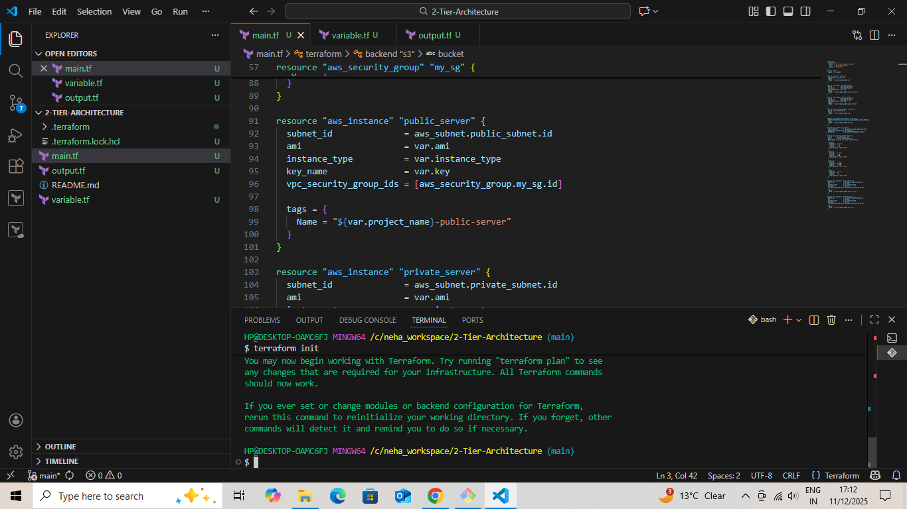

## Plan Terraform Deployment
```bash
terraform plan
```
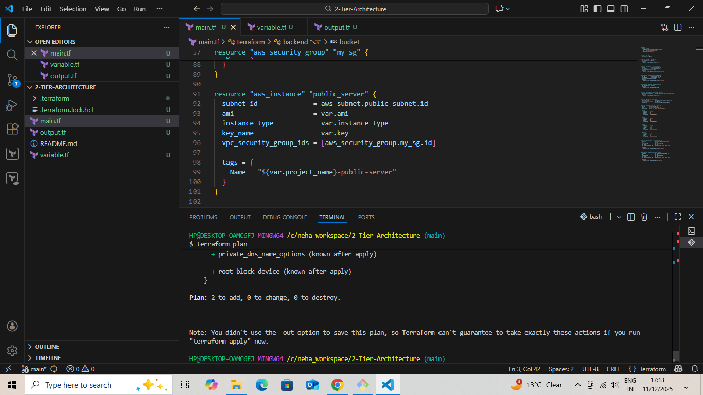

## Apply Terraform Deployment
```bash
terraform apply --auto-approve
```
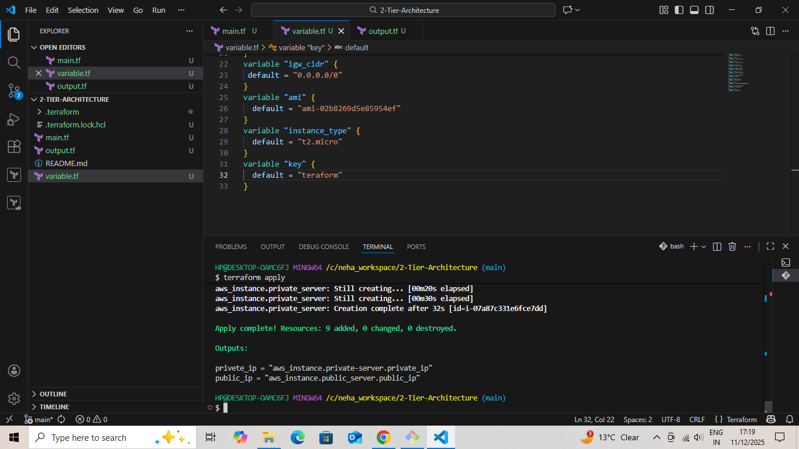

 AWS Resources Created

- EC2 Instances: Public App Server, Private DB Server

- VPC with Public & Private Subnets

- Internet Gateway attached to VPC

- Route Tables for routing

- Security Group with SSH, HTTP, MySQL rules

- S3 Bucket for Terraform backend

## Screenshots:
### - EC2 Instance: 
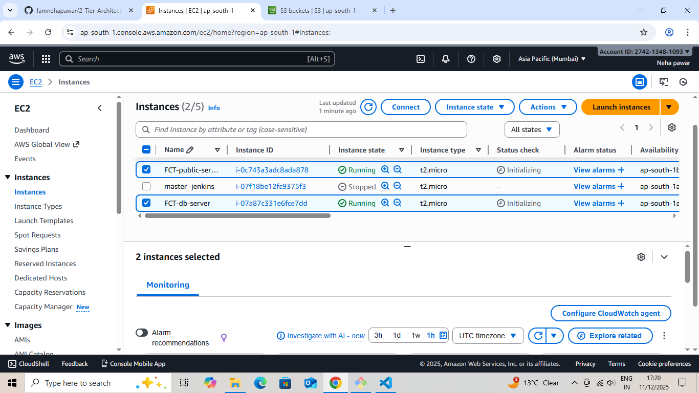

### Subnet: 
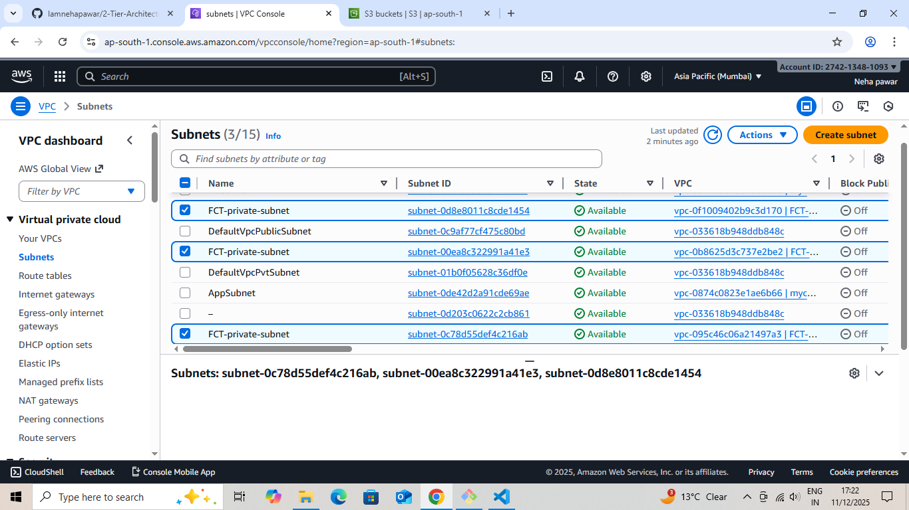

### Route Table: 
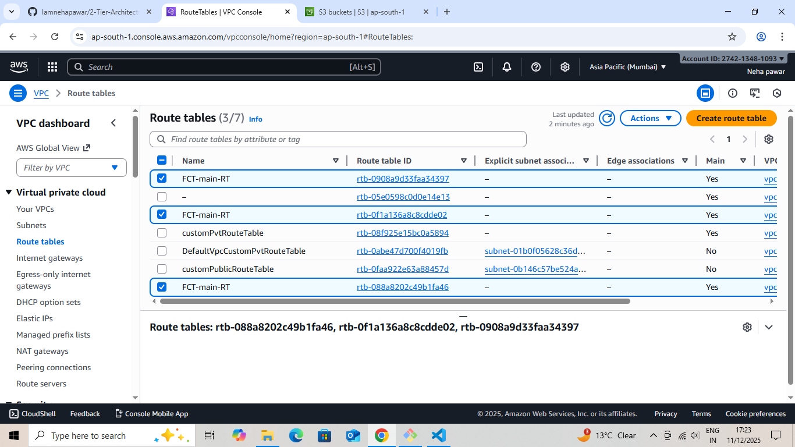

### Internet Gateway:
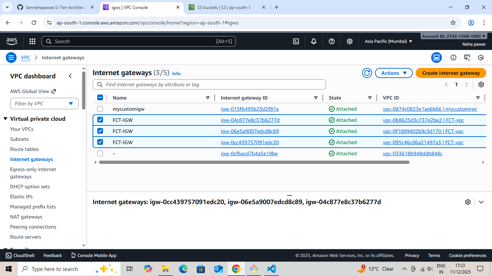

### Security Group:
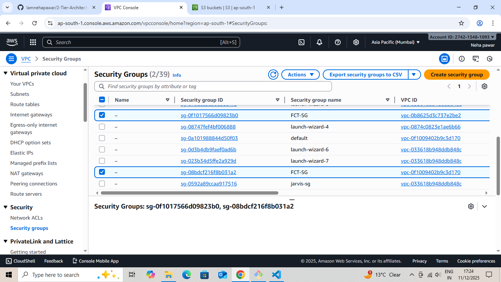

### S3 Bucket:
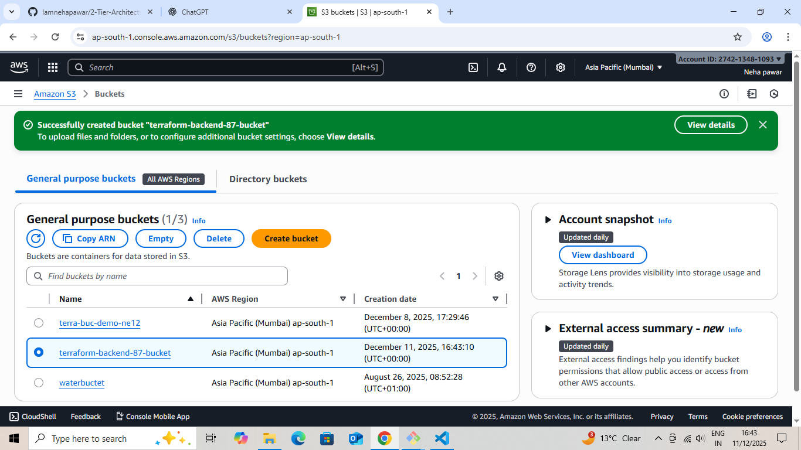

### VPC 
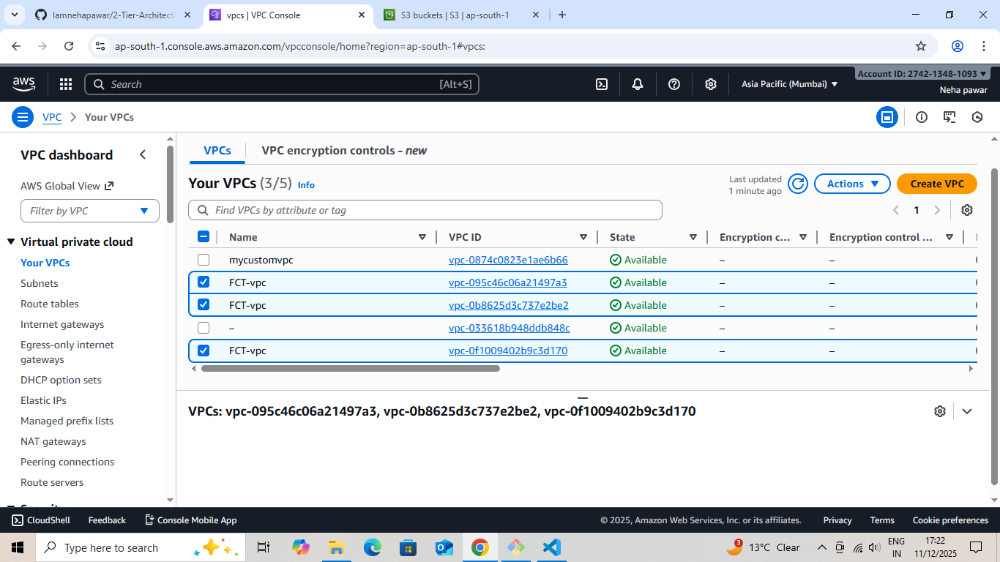

##  Destroy Terraform Resources
```bash
terraform destroy
```
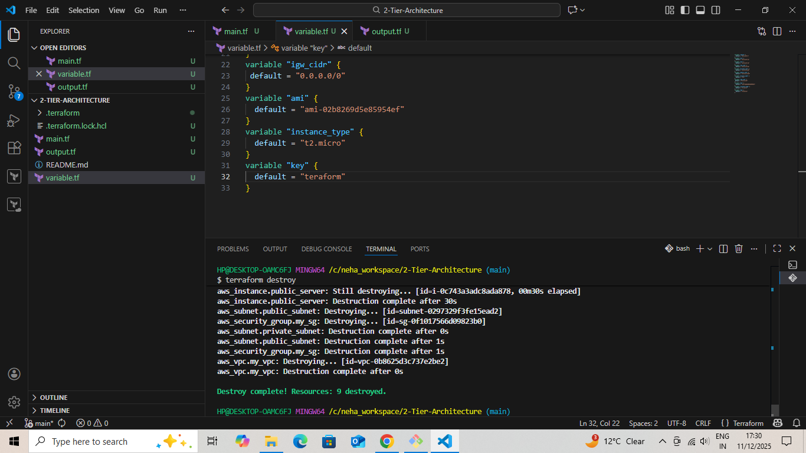

## Notes

1. AWS credentials must be configured (aws configure) before running Terraform.

2. Security Groups are open to 0.0.0.0/0 for demo purposes; restrict IPs in production.

3. S3 Backend must exist or Terraform should have permissions to create it.

**Author:** Neha Pawar ([Iamnehapawar](https://github.com/Iamnehapawar))
